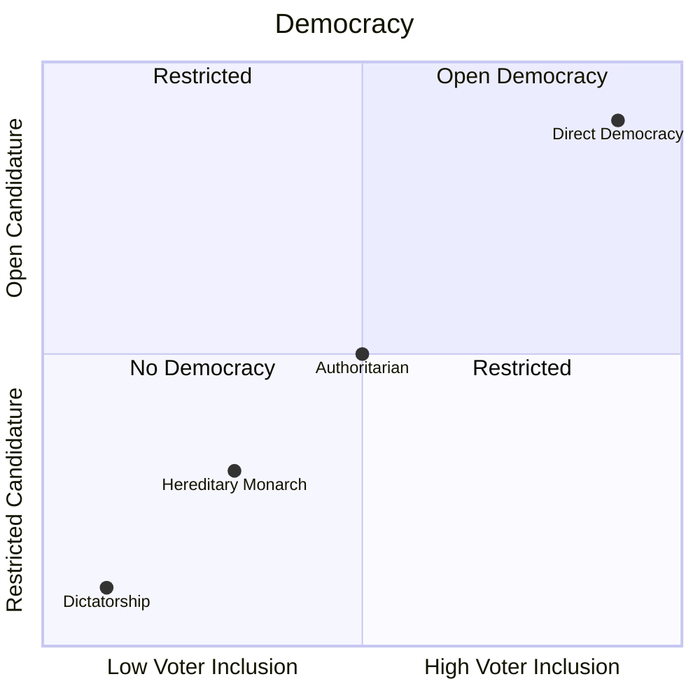
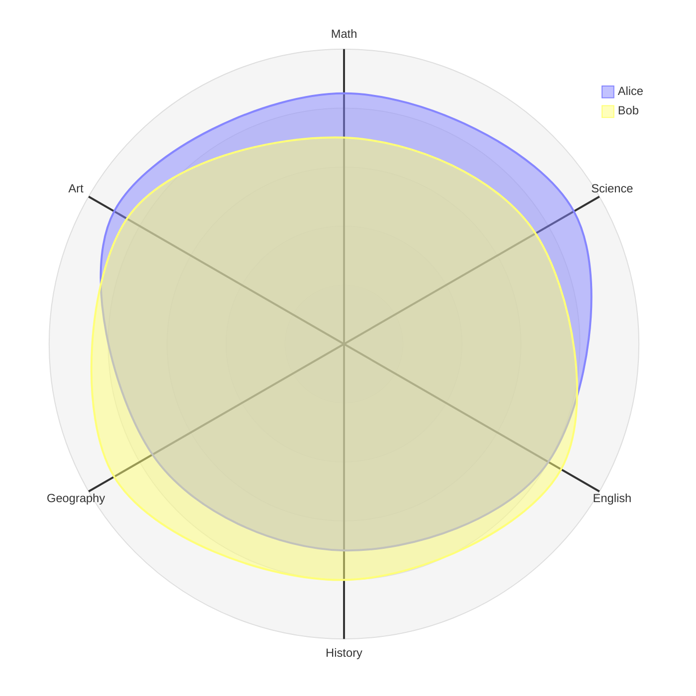
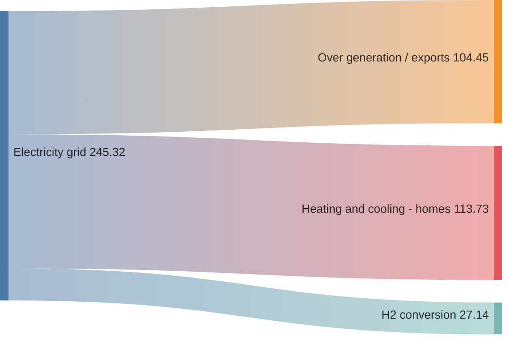

#   Nested Page

A nested page weith some Mermaid test diagrams

```mermaid
quadrantChart
    title Democracy
    x-axis Low Voter Inclusion --> High Voter Inclusion
    y-axis Restricted Candidature --> Open Candidature
    quadrant-1 Open Democracy
    quadrant-2 Restricted
    quadrant-3 No Democracy
    quadrant-4 Restricted
    Dictatorship: [0.1, 0.1]
    Hereditary Monarch: [0.3, 0.3]
    Authoritarian: [0.5, 0.5]
    Direct Democracy: [0.9, 0.9]
```

```mermaid
radar-beta

    axis m["Math"], s["Science"], e["English"]
    axis h["History"], g["Geography"], a["Art"]
    curve a["Alice"]{85, 90, 80, 70, 75, 90}
    curve b["Bob"]{70, 75, 85, 80, 90, 85}
    
    max 100
    min 0
```

```mermaid
sankey
    %% source,target,value
    Electricity grid,Over generation / exports,104.453
    Electricity grid,Heating and cooling - homes,113.726
    Electricity grid,H2 conversion,27.14
```
