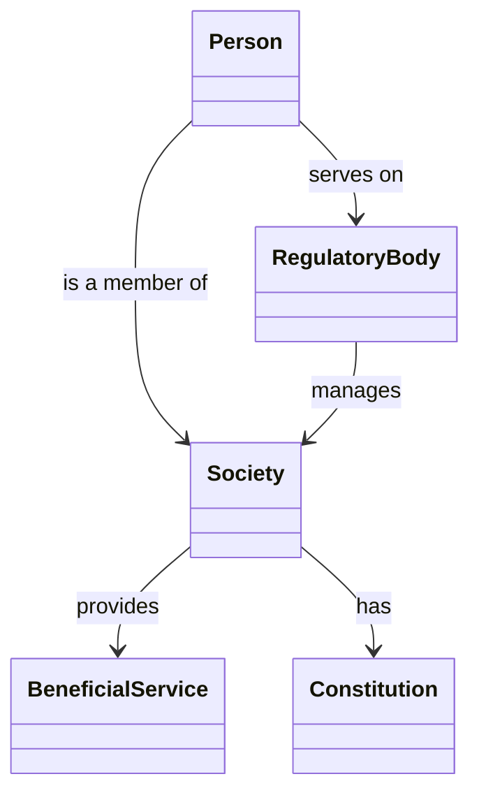

#   Just The Docs Test Homepage

- This document should contain just the overview text and optionally entry points to significant other files.
- The "Home" title and layout are required to ensure that this file is picked by as the entry point for the actiual GitHub Pages to render correctly
- All other pages should have their own front-matter to be included in the generated Contents

##  Test for Mermaid Class Diagram

[Nested Diagram Test Page](NestedPage.md)
