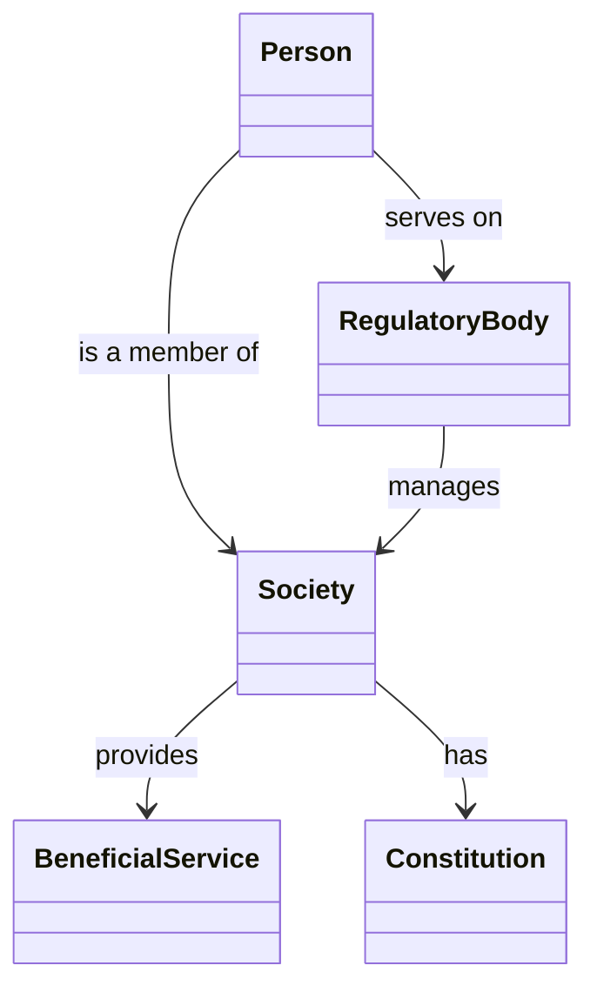

# just-the-docs-template Test

[Original Setup Text](SetupText.md)

Test for Mermaid Class Diagram

```mermaid
classDiagram 

    class Person
    class Society
    class BeneficialService
    class RegulatoryBody
    class Constitution
    
    Person --> Society : is a member of
    RegulatoryBody --> Society : manages
    Person --> RegulatoryBody : serves on
    Society --> BeneficialService : provides
    Society --> Constitution : has

%%    Society <|-- GeroPoliticalGroup : is a type of
```
