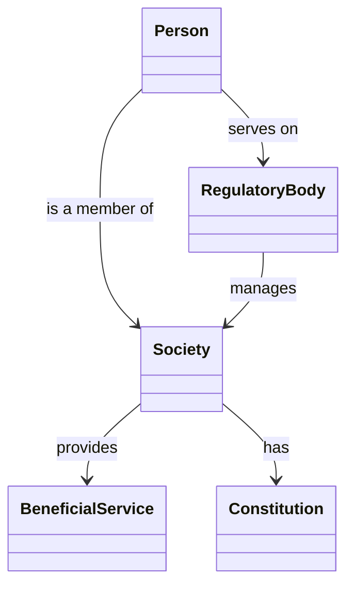

#   Just The Docs Test Homepage

This document should contain just the overview text and a list of contents

Not yet sure how it integrates with the ReadMe.md file. 
In the original clone the Index.md and ReadMe.md files looked to be copies of each other which is a maintenance overhead I don't need.

Hopefully I'll find a way to integrate those two files to avoid duplication.

##  Test for Mermaid Class Diagram 

[Nested Diagram Test Page](NestedPage.md)

----

[Just the Docs]: https://just-the-docs.github.io/just-the-docs/
[GitHub Pages]: https://docs.github.com/en/pages
[README]: https://github.com/just-the-docs/just-the-docs-template/blob/main/README.md
[Jekyll]: https://jekyllrb.com
[GitHub Pages / Actions workflow]: https://github.blog/changelog/2022-07-27-github-pages-custom-github-actions-workflows-beta/
[use this template]: https://github.com/just-the-docs/just-the-docs-template/generate
